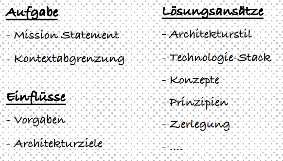
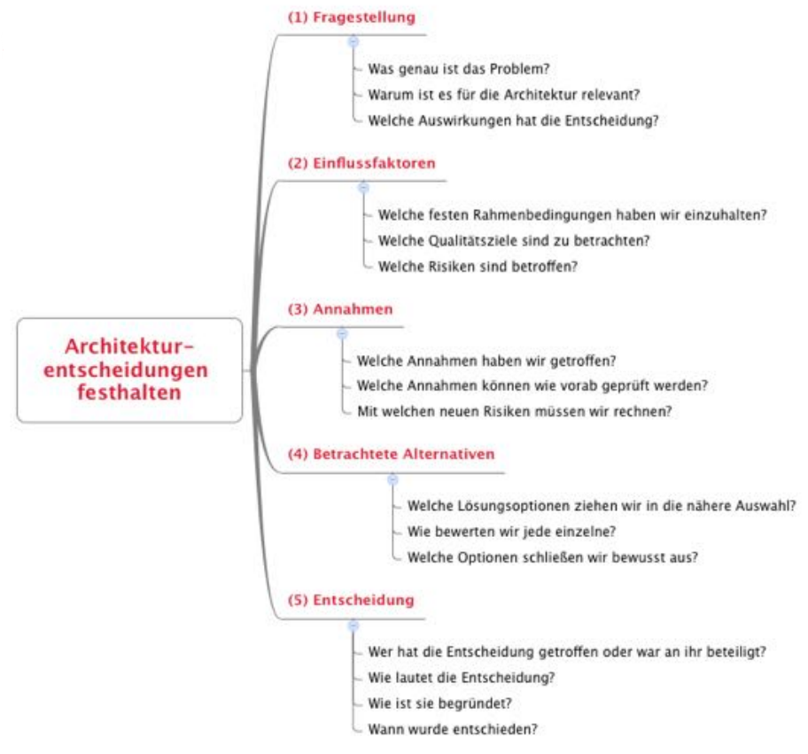

# Documenting microservices

## Motivation

## Context

### Overview

### Minimal architectural overview

### Profile per service

#### Typical contents for a service profile

- Responsibility i.e. what does the service do
- Special requirements
- Technology Stack
- Interface definition (API)
- Important ideas / solutions for the service
- contact person
- Plans for the future
- Technical debts

### Concepts

- [How to write concepts](./how-to_write_concepts.md)

### Decisions

## Example

## Next steps
