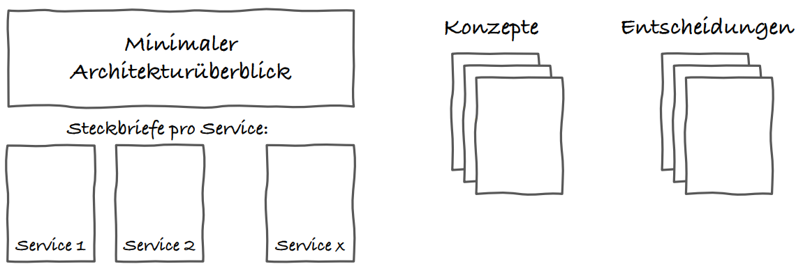

# How to document microservices

## Motivation

Documentation is usually a burden for developers and is often neglected. Especially in microservices, documentation is essential to understand how the service landscape is structured and where which capabilities lie. In addition, it should be possible to answer core questions, such as overarching concepts, architecture decisions and also goals, simply and sustainably.

It is important to use a documentation template that requires minimal maintenance to ensure a high degree of up-to-dateness and to reduce inhibitions of developers to maintain documentation.

## Context

### A minimalistic approach

### Minimal architectural overview

### Profile per service

#### Typical contents for a service profile

- Responsibility i.e. what does the service do
- Special requirements
- Technology Stack
- Interface definition (API)
- Important ideas / solutions for the service
- contact person
- Plans for the future
- Technical debts

### Concepts

- [How to write concepts](./how-to_write_concepts.md)

### Decisions

## Example

## Next steps
