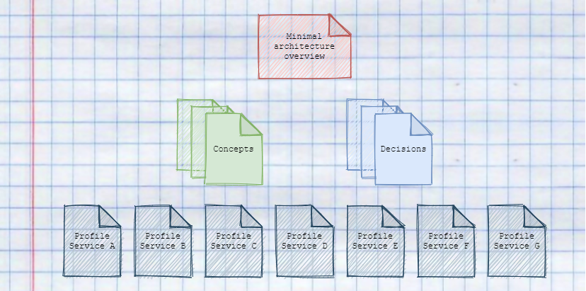
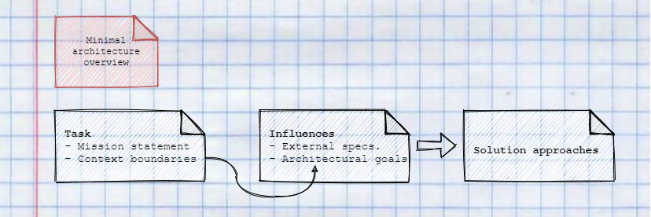
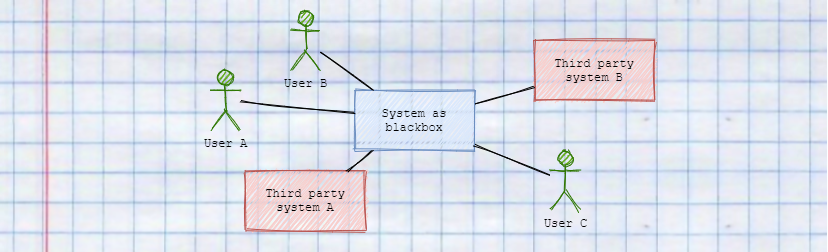
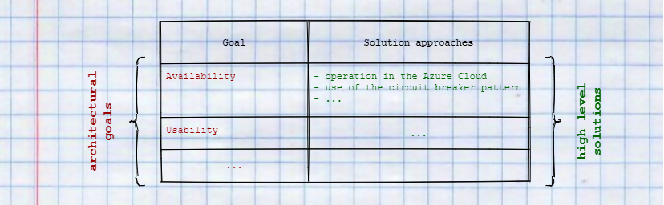
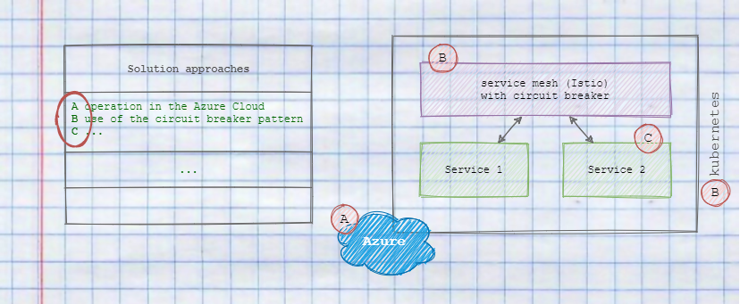
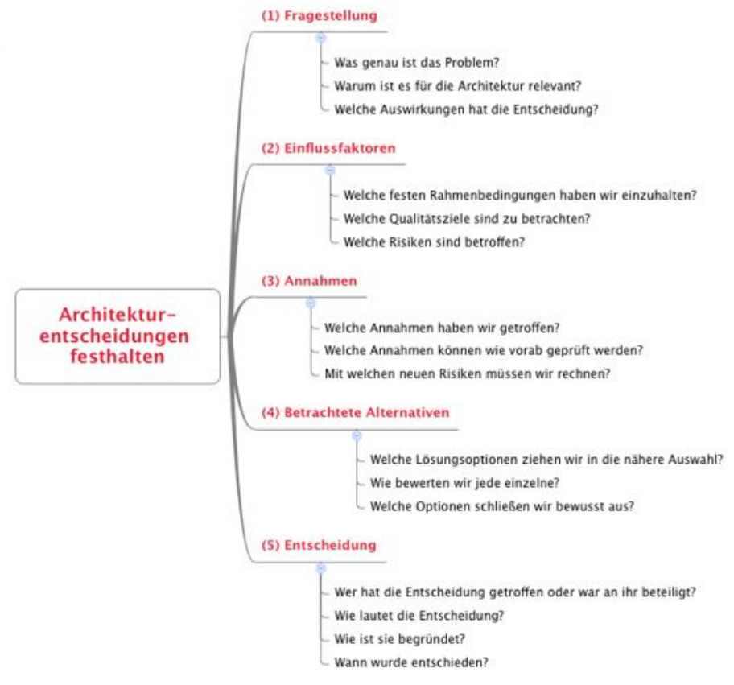

## Motivation

Documentation is usually a burden for developers and is often neglected. Especially in microservices, documentation is essential to understand how the service landscape is structured and where which capabilities lie. In addition, it should be possible to answer core questions, such as overarching concepts, architecture decisions and also goals, simply and sustainably.

It is important to use a documentation template that requires minimal maintenance to ensure a high degree of up-to-dateness and to reduce inhibitions of developers to maintain documentation.

## Context

### A minimalistic approach

This approach is structured into four documentation types to describe the macro and micro architectures of a project. Method and example were described by [Stefan Zörner][1].

At first the minimal architecture overview provides insights about the mission and context of the architecture. Furthermore, solution approaches, specifications, non-functional requirements, and objectives of the architecture are also defined.  

Through context delimitation and mission objectives, concrete decisions for the macro architecture can be made and distributed through concepts within the team.

Concepts describe why, what and how these decisions should be implemented and provide the framework for making decisions for the micro architecture within the individual services.

In order to also document the micro architecture of the microservices, a profile is created for each service, in which specific information such as contact persons, approaches to solutions, but also technical debts are recorded.

### Micro vs. macro architecture

One of the [Independent Systems Architecture (ISA) principles][2] states, that each... 
> "[...] system must have two clearly separated levels of architectural decisions. The macro architecture comprises decisions that cover all modules. [...] The micro architecture considers decisions which may be taken individually for each module".

This leads to a fundamental decision whether a solution option at the macro-architecture level should lead to standardisation for all services or whether the solution can be re-evaluated in each service to ensure the best possible outcome.

In other words, decisions at macro level offer standardisation, whereas decisions at micro level create individualisation.

### Minimal architecture overview

#### Structure

The overview consists of three parts. In the first part, the task, the mission objective and context boundaries are used to describe which objectives are to be achieved.

In the second part, influences define both external specifications and architectural goals. These goals are recorded in the form of non-functional requirements and are derived from the work result of the first part.

Based on the defined influences, the third part contains concrete solution approaches. For example, architectural styles or concrete technologies can be defined to solve certain challenges.

#### Task

In the mission statement, the tasks and objectives of the system are described in bullet points or short sentences. The following guiding questions should be answered briefly and concisely:

- What is the software system for?
- What is the central sales/use argument? ("claim", "slogan")
- Who benefits from it?
- What are the main features of the system?
- How does it differ from products of competitors, or the previous version?

By means of context boundaries, the mission statement is narrowed down and users and external systems with which the system interacts are visualised.

#### Influences

Influences describe core requirements of the system by means of two vectors. On the one hand, external specifications reduce the solution space and exclude options in advance. These include technical requirements such as "we are going to the cloud" as well as organisational requirements such as working methods or team composition.

On the other hand, the top three to five [non-functional requirements][3] are defined and tabulated by means of a short description or motivation in order to describe the architectural goals of the system. It is crucial to take these into account as early as possible in the decision-making process, as these requirements shape the solution and can only be integrated subsequently at great additional expense.

It is also important that each requirement of the system is checked for interactions between the individual influences, as influences can also exclude each other. For example, it would make sense to introduce CAPTCHAs at login to increase security. However, usability would suffer because users find additional security measures disturbing. In such cases, compromises are made.

#### Solution approaches

The solutions are derived from the previously defined influences and assigned to the non-functional requirements. In this way, a table is developed that specifies concrete "high level" solutions for each requirement. As an example, the requirement availability can be assigned to "operation in the Azure Cloud" and "use of the circuit breaker pattern" in order to increase availability and resilience.

It is important to note that the defined solutions can be pure ideas or approaches as well as concrete decisions or concepts (see below).

To concretise these solutions, the approaches are visualised in a diagram of the architecture. The aim here is not to provide a complete overview, but to illustrate where the solutions are used. This is important to achieve a delineation of which requirements need to be considered at which levels of the architecture. For example, if Resilience is covered by a service mesh in k8s, the circuit breaker pattern would no longer need to be integrated into the individual services.

### Decisions

### Concepts

- [How to write concepts](write_concepts.md)

### Profiles

Typical contents for a service profile:

- Responsibility i.e. what does the service do
- Special requirements
- Technology Stack
- Interface definition (API)
- Important ideas / solutions for the service
- contact person
- Plans for the future
- Technical debts

## Example

## Next steps

[1]: <https://www.embarc.de/stefan-zoerner/> "Gut das ist? Umgekehrte Architekturbewertung eines Internetgiganten"
[2]: <https://isa-principles.org/> "Independent Systems Architecture principles"
[3]: <https://www.embarc.de/software-qualitaet-iso-25010/> "ISO, weshalb warum? Ist Software-Qualität Geschmackssache?"
