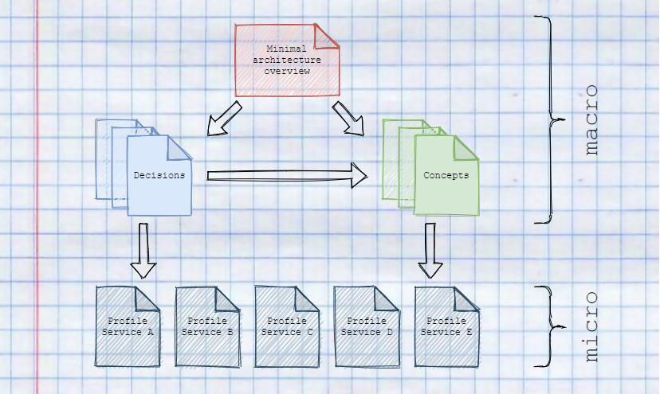

## Motivation

Documentation is usually a burden for developers and is often neglected. Especially in microservices, documentation is essential to understand how the service landscape is structured and where which capabilities lie. In addition, it should be possible to answer core questions, such as overarching concepts, architecture decisions and also goals, simply and sustainably.

It is important to use a documentation template that requires minimal maintenance to ensure a high degree of up-to-dateness and to reduce inhibitions of developers to maintain documentation.

## Context

### A minimalistic approach

This approach is structured into four documentation types to describe the macro and micro architectures of a project.

At first the minimal architecture overview provides insights about the mission and context of the architecture. Furthermore, specifications, non-functional requirements, and objectives of the architecture are also defined.  

Through context delimitation and mission objectives, concrete decisions for the macro architecture can be made and distributed through concepts within the team.

Concepts describe why, what and how these decisions should be implemented and provide the framework for making decisions for the microarchitecture within the individual services.

In order to also document the microarchitecture of the microservices, a profile is created for each service, in which specific information such as contact persons, approaches to solutions, but also technical debts are recorded.

### Minimal architecture overview

### Profile per service

#### Typical contents for a service profile

- Responsibility i.e. what does the service do
- Special requirements
- Technology Stack
- Interface definition (API)
- Important ideas / solutions for the service
- contact person
- Plans for the future
- Technical debts

### Concepts

- [How to write concepts](write_concepts.md)

### Decisions

## Example

## Next steps
