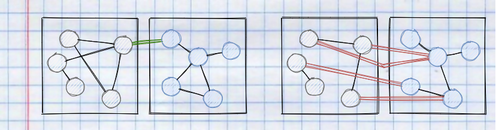

## Definition

The single responsibility principle is a computer programming principle that states that every module, class, or function should have responsibility over a single part of the functionality provided by the software, and that responsibility should be entirely encapsulated by the class.

> A class should have only one reason to change [..]. - Robert C. Martin

## Guidelines

- Isolate cross cutting concerns and domain specific classes​
- Dont reference external frameworks in POCO/DTO​
- Prevent god classes to increase cohesion and readability​
- Give meaningful names​
- Write small classes so that everything can be seen at a glance​ (10 seconds)

## Cohesion

- Cohesion refers to the degree to which the elements inside a module belong together​
- Measure of the strength of relationship between the class's methods and data themselves​
- Modules can be scoped as applications, projects, classes or methods​
- Cohesion is balanced with both unit complexity and coupling​
- High cohesion often correlates with loose coupling​
